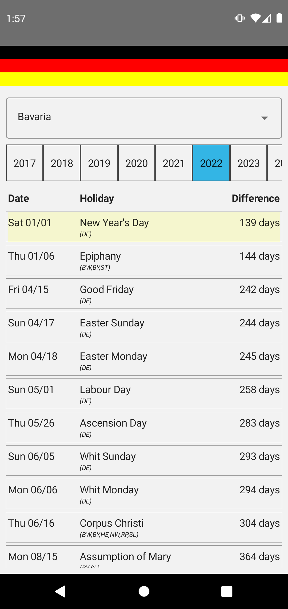
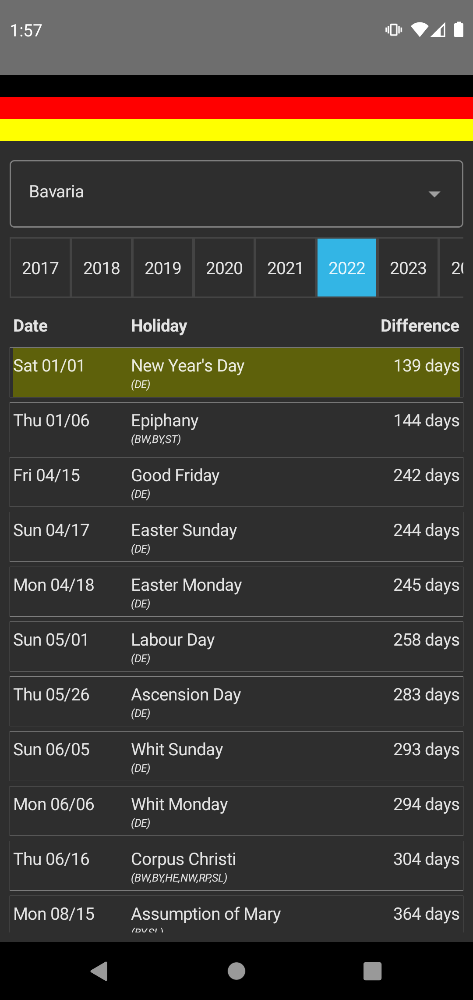

# DeuFeiTage

## About

This GitHub repository hosts the code of the Android app _DeuFeiTage_. _DeuFeiTage_ shows the holidays of the german 
states.

Dieses GitHub Repository hostet den Code der Android-App _DeuFeiTage_. _DeuFeiTage_ zeigt die Feiertage für die einzelnen Bundesländer von Deutschland.

## Screenshots

## Compatibility

This app is compatible from sdk version 23 (Android 6.0) upward.

## License

**Copyright 2019-2021 by MicMun**

This program is free software: you can redistribute it and/or modify it under the terms of the GNU
General Public License as published by the Free Software Foundation, either version 3 of the License, or
(at your option) any later version.
This program is distributed in the hope that it will be useful, but WITHOUT ANY WARRANTY;
without even the implied warranty of MERCHANTABILITY or FITNESS FOR A PARTICULAR PURPOSE.
See the GNU General Public License for more details.

You should have received a copy of the GNU General Public License along with this program. If not, see
[http://www.gnu.org/licenses/](http://www.gnu.org/licenses/).
